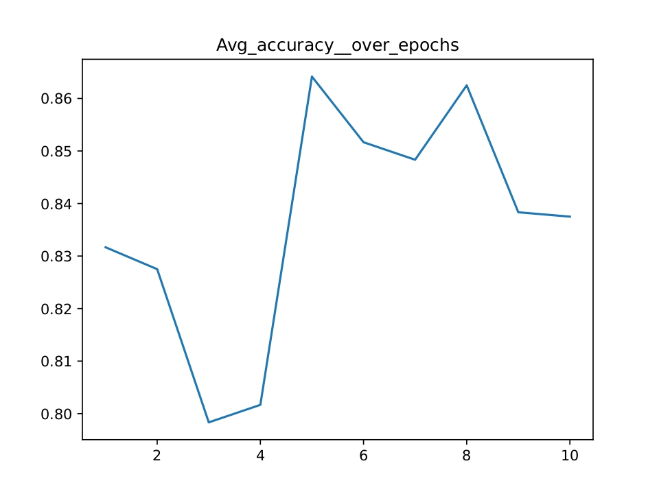
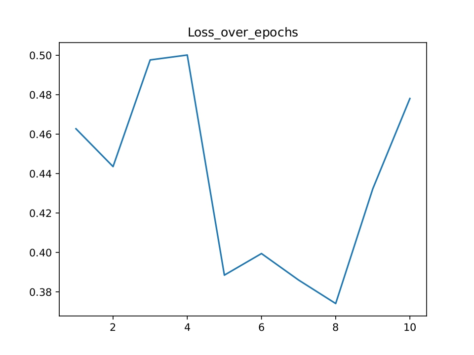
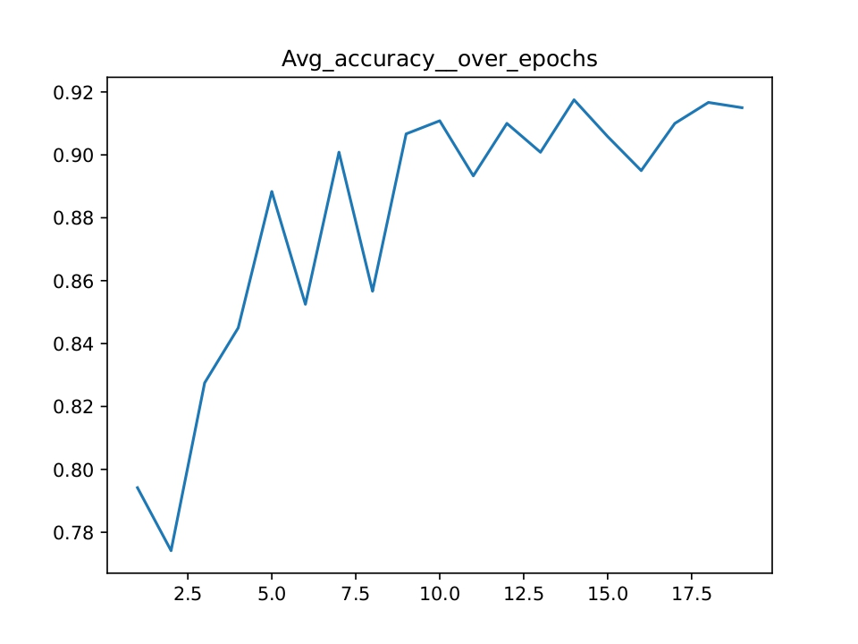
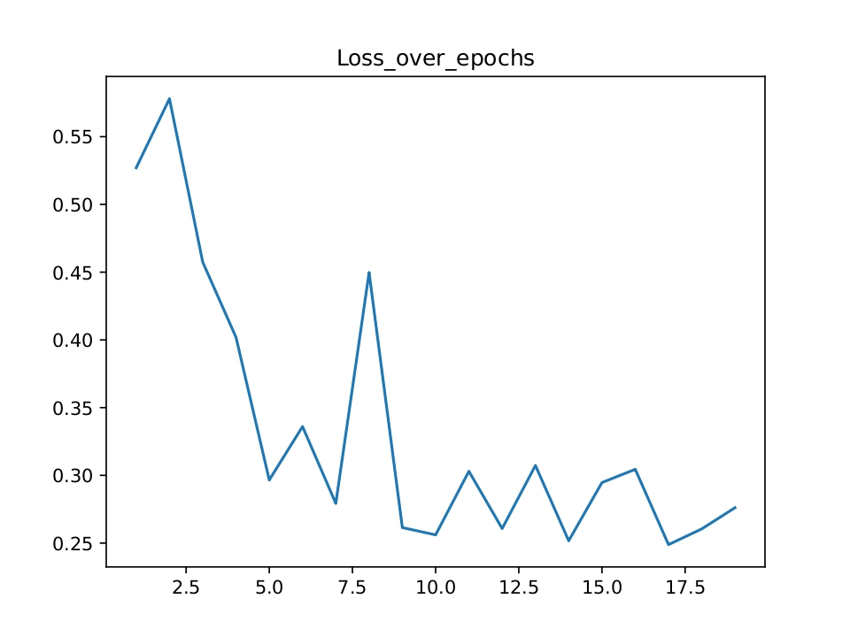
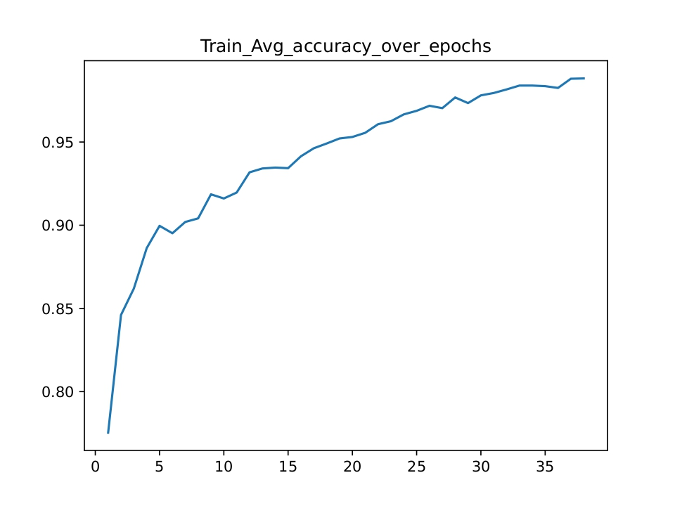
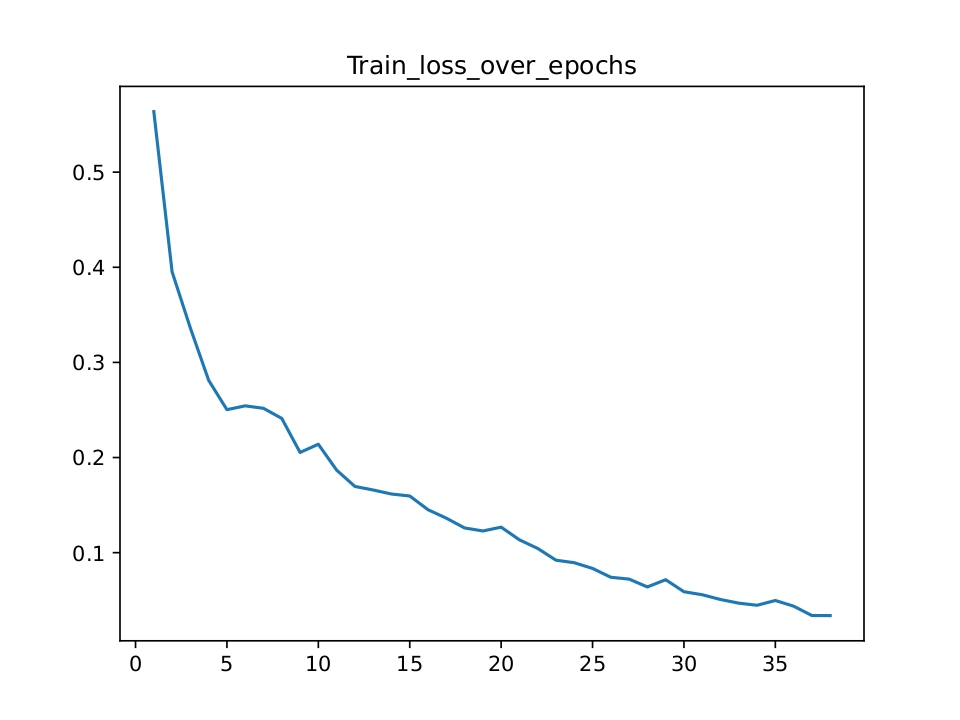
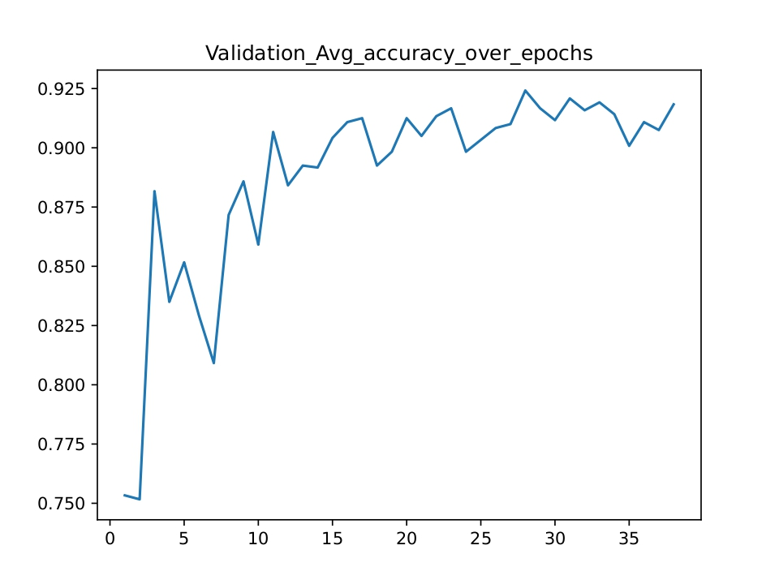
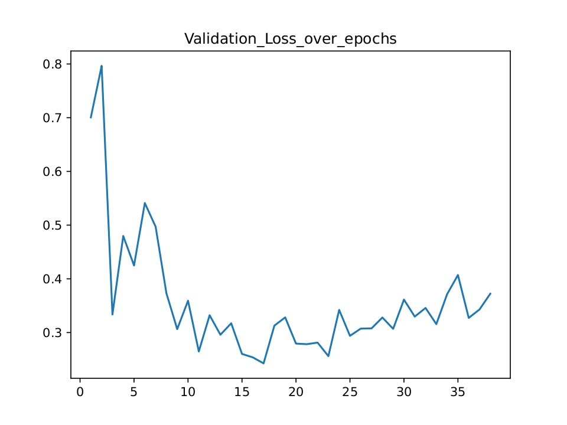

# MLSP Project - Medical images classification 
## Smarandoiu Elena-Andrada

# ResNet18
### First Pipepline(experimental)

The first ever pipeline I tried used the ResNet-18 model with pretrained weights.

Parameters:

image_size = 255 (left by accident and forgot to be modified)
num_classes = 8
epochs = 10
batch_size=32
loss_fn = CrossEntropyLoss
optimizer = Adam with lr = 0.001
My default train/test/validate subsets are 70%/15%/15%.
Trained on my CPU.

After Epoch 3 the model had an imbalance and the accuracy dropped. That may be because
I used a constant learing rate of 0.001 that is too fast. I also did not include image
augmentation to the training set so the model strated overfitting. 

<details>
  <summary><font color = "red"><strong><h1>Result:</h1></strong></font></summary>

```bash
*******Epoch 1
********
loss: 2.127033 [   32/ 5600]
loss: 0.362255 [ 3232/ 5600]
Total Error: 
 Accuracy: 69.7%, Avg loss: 0.950311 

*******Epoch 2
********
loss: 0.343875 [   32/ 5600]
loss: 0.373111 [ 3232/ 5600]
Total Error: 
 Accuracy: 85.5%, Avg loss: 0.355746 

*******Epoch 3
********
loss: 0.356200 [   32/ 5600]
loss: 0.454971 [ 3232/ 5600]
Total Error: 
 Accuracy: 77.1%, Avg loss: 0.922786 

*******Epoch 4
********
loss: 0.321209 [   32/ 5600]
loss: 0.356717 [ 3232/ 5600]
Total Error: 
 Accuracy: 73.2%, Avg loss: 0.761545 

*******Epoch 5
********
loss: 0.226473 [   32/ 5600]
loss: 0.157488 [ 3232/ 5600]
Total Error: 
 Accuracy: 77.8%, Avg loss: 0.694455 

*******Epoch 6
********
loss: 0.347281 [   32/ 5600]
loss: 0.148285 [ 3232/ 5600]
Total Error: 
 Accuracy: 80.7%, Avg loss: 0.483458 

*******Epoch 7
********
loss: 0.348611 [   32/ 5600]
loss: 0.184555 [ 3232/ 5600]
Total Error: 
 Accuracy: 81.3%, Avg loss: 0.610616 

*******Epoch 8
********
loss: 0.084579 [   32/ 5600]
loss: 0.075264 [ 3232/ 5600]
Total Error: 
 Accuracy: 86.7%, Avg loss: 0.415986 

*******Epoch 9
********
loss: 0.034485 [   32/ 5600]
loss: 0.034047 [ 3232/ 5600]
Total Error: 
 Accuracy: 84.6%, Avg loss: 0.558827 

*******Epoch 10
********
loss: 0.052264 [   32/ 5600]
loss: 0.165139 [ 3232/ 5600]
Total Error: 
 Accuracy: 86.3%, Avg loss: 0.374461 

Test Error: 
 Accuracy: 86.8%, Avg loss: 0.391537 
```

</details>

### Second Pipeline

Papers:
https://www.mdpi.com/1424-8220/23/6/3176 (for pipeline and augmentation) [1]
https://www.nature.com/articles/s41598-024-53955-8 (suppoorting augmentation decision) [2]

image_size = moddified corresponding to the resnet18
num_classes = 8
epochs = 20 maximum
batch_size = 64
loss_fn = CrossEntropyLoss
optimizer = Adam with lr = 0.001
scheduler = stepLR with step = 2 and gamma = 0.9
My default train/test/validate subsets are 70%/15%/15%.
Trained on T4 GPU(on google colab)

I started implementing image augmentation for which I took inspiration from two paper, both
focusing on the classification of endoscopic images. The first paper concluded that high changes
in hue and color don't save the model from overfitting when it comes to medical images (even 
deleting the two classes with coloured polyps from the dataset). It proposed 
a change in only brightness and contrast along with slight rotation so that the change overall
would be more subtle.

The second paper's findings supported the idea that only subtle changes should be made in colour
and in addition also varried the contrast of the images. It also argued that geometrical variations
such as horizontal or vertical flips are safe for medical images because they do not have a definite
up, down or direction.

For the augmentation process I combined these findings and set a probability for each operation.

I used the way paper [1] dealt with the imbalance after epoch 3 and used a StepLr scheduler. I kept
the intial learning rate for the Adam as 0.001 but decreased it at every 2 steps. My training loop
keeps track of the best accuracy, saves and updates the best model. I initially put a maximum of
20 epochs because my model starting downgrading around the epoch 15-16, and had a tolerance of of
5 epochs (exiting early if the model did not improve). I chose step = 2 to keep the ration in the
first paper (that downgraded the lr every 10 steps for 100 epochs). By lowering the step I obtained
a much stable and nicer result.

<details>
  <summary><font color = "red"><strong><h1>Result</h1></strong></font></summary>

```bash
*******Epoch 1
********
loss: 2.080967 [   64/ 5600]
Total Error: 
 Accuracy: 79.4%, Avg loss: 0.527032 

*******Epoch 2
********
loss: 0.285388 [   64/ 5600]
Total Error: 
 Accuracy: 77.4%, Avg loss: 0.578005 

*******Epoch 3
********
loss: 0.473114 [   64/ 5600]
Total Error: 
 Accuracy: 82.8%, Avg loss: 0.457399 

*******Epoch 4
********
loss: 0.096653 [   64/ 5600]
Total Error: 
 Accuracy: 84.5%, Avg loss: 0.401938 

*******Epoch 5
********
loss: 0.189172 [   64/ 5600]
Total Error: 
 Accuracy: 88.8%, Avg loss: 0.296597 

*******Epoch 6
********
loss: 0.232901 [   64/ 5600]
Total Error: 
 Accuracy: 85.2%, Avg loss: 0.336027 

*******Epoch 7
********
loss: 0.233013 [   64/ 5600]
Total Error: 
 Accuracy: 90.1%, Avg loss: 0.279292 

*******Epoch 8
********
loss: 0.116723 [   64/ 5600]
Total Error: 
 Accuracy: 85.7%, Avg loss: 0.449767 

*******Epoch 9
********
loss: 0.132275 [   64/ 5600]
Total Error: 
 Accuracy: 90.7%, Avg loss: 0.261461 

*******Epoch 10
********
loss: 0.140527 [   64/ 5600]
Total Error: 
 Accuracy: 91.1%, Avg loss: 0.256072 

*******Epoch 11
********
loss: 0.136913 [   64/ 5600]
Total Error: 
 Accuracy: 89.3%, Avg loss: 0.303025 

*******Epoch 12
********
loss: 0.147198 [   64/ 5600]
Total Error: 
 Accuracy: 91.0%, Avg loss: 0.260764 

*******Epoch 13
********
loss: 0.167088 [   64/ 5600]
Total Error: 
 Accuracy: 90.1%, Avg loss: 0.307299 

*******Epoch 14
********
loss: 0.157253 [   64/ 5600]
Total Error: 
 Accuracy: 91.8%, Avg loss: 0.251725 

*******Epoch 15
********
loss: 0.170722 [   64/ 5600]
Total Error: 
 Accuracy: 90.6%, Avg loss: 0.294685 

*******Epoch 16
********
loss: 0.098334 [   64/ 5600]
Total Error: 
 Accuracy: 89.5%, Avg loss: 0.304484 

*******Epoch 17
********
loss: 0.104244 [   64/ 5600]
Total Error: 
 Accuracy: 91.0%, Avg loss: 0.248873 

*******Epoch 18
********
loss: 0.152483 [   64/ 5600]
Total Error: 
 Accuracy: 91.7%, Avg loss: 0.260493 

*******Epoch 19
********
loss: 0.106332 [   64/ 5600]
Total Error: 
 Accuracy: 91.5%, Avg loss: 0.276151 

Stopped at epoch 19
Using cuda device Test Error:   Accuracy: 90.1%, Avg loss: 0.252590
```
</details>

#### Metrics for step = 10
 

#### Metrics for step = 2
 

### Reproducibility

After obtaining a strong pipeline I set a random seed (42) to ensure reproducibility later, maintaining the parameters as before. After seeing the new trend of the model I chose
to increase the maximum number of epochs to 50 and set the tolerance to 10.

#### Train Metrics
 

### Validation Metrics
 

The plots resemble those in the first paper.

## Test metrics


```bash
Test Error: 
 Accuracy: 90.8%, Avg loss: 0.313422 

                        precision    recall  f1-score   support

    dyed-lifted-polyps     0.9437    0.8933    0.9178       150
dyed-resection-margins     0.9051    0.9533    0.9286       150
           esophagitis     0.7561    0.8267    0.7898       150
          normal-cecum     0.9610    0.9867    0.9737       150
        normal-pylorus     0.9677    1.0000    0.9836       150
         normal-z-line     0.8074    0.7267    0.7649       150
                polyps     0.9856    0.9133    0.9481       150
    ulcerative-colitis     0.9477    0.9667    0.9571       150

              accuracy                         0.9083      1200
             macro avg     0.9093    0.9083    0.9079      1200
          weighted avg     0.9093    0.9083    0.9079      1200
```

The total accuracy came at 90,8% consistent with the first result of 90,1%.
The confusion matrix shows a correlation between esophagitis and the z-line
but that is also consistent with the second paper as the z-line is also present
in the esophagitis photos.

22:15 -> 23:30

### Improvement

The initial image resizing and crop were according to the ImageNet standard but in the
second paper only resizing was used to make the photo a size the model could work with.
Also the high confusion between the esophagitis and the z-line made me think that by
cropping a good part of the details are lost when working with medical images. I tried
to only resize the image even if it will shrink to test wheter the performace changes.

The result was that the test accuracy went up to 92,3%, the Z-line recall jumped from
0.7267 to 0.8267 and the esophagitis recal barely differed with 0.8267 to 0.86.

Dropping the crop fixed some problems with the model recognizing the normal-z-line with
the distintive features maybe being located on the edge of the frame. The most stubborn
class remains esophagitis.

```bash
Test Error: 
 Accuracy: 92.3%, Avg loss: 0.235137 

                        precision    recall  f1-score   support

    dyed-lifted-polyps     0.9320    0.9133    0.9226       150
dyed-resection-margins     0.9276    0.9400    0.9338       150
           esophagitis     0.8377    0.8600    0.8487       150
          normal-cecum     0.9797    0.9667    0.9732       150
        normal-pylorus     0.9677    1.0000    0.9836       150
         normal-z-line     0.8552    0.8267    0.8407       150
                polyps     0.9650    0.9200    0.9420       150
    ulcerative-colitis     0.9231    0.9600    0.9412       150

              accuracy                         0.9233      1200
             macro avg     0.9235    0.9233    0.9232      1200
          weighted avg     0.9235    0.9233    0.9232      1200
```

Still overfitting was present with the train loss keeping to lower and validation loss
keeping to rise towards the end, train accuracy climbed while validation accuracy stayed
flat. I tried to follow the second's paper recipe to use SGD for optimization, cosine
decay learning rate with lr = 0.001, weight decay = 0 and keep the cross entropy loss.

```bash
Test Error: 
 Accuracy: 92.8%, Avg loss: 0.183802 

                        precision    recall  f1-score   support

    dyed-lifted-polyps     0.9177    0.9667    0.9416       150
dyed-resection-margins     0.9718    0.9200    0.9452       150
           esophagitis     0.8322    0.8267    0.8294       150
          normal-cecum     0.9673    0.9867    0.9769       150
        normal-pylorus     0.9803    0.9933    0.9868       150
         normal-z-line     0.8289    0.8400    0.8344       150
                polyps     0.9653    0.9267    0.9456       150
    ulcerative-colitis     0.9667    0.9667    0.9667       150

              accuracy                         0.9283      1200
             macro avg     0.9288    0.9283    0.9283      1200
          weighted avg     0.9288    0.9283    0.9283      1200
```

In terms of accuracy the model did not differ that much but the change reduced the
overfitting visibly and also dropped the loss from  0.235137  to 0.183802. The train
and loss curves also got smoother.

 

 

 

I tried training the model with a higher resolution of the images of 320 in case
some details were lost but the results showed no real improvement and similar results
with a higher training time (1h 10m vs under an hour).

# EfficientNetB0

I trained EfficientNetB0 with the same parameters, optimzer, scheduler and loss as the
ResNet18 and the results were similar with ResNet18 being a little bit better in accuracy.


